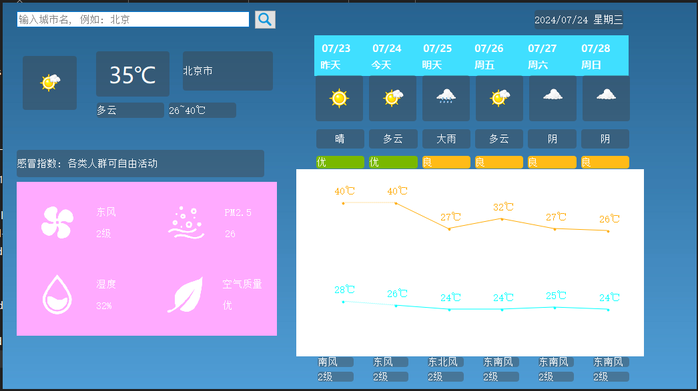

# qt_weather

**Qt天气预报客户端** 

**环境**： Windows 10 + Qt 5.15.2
**项目简介**：该项目是使用Qt集成开发环境编写，实现用户输入城市名字，显示当天以及6天的天气数据。
**主要技术：** C++、Qt、Json、HTTP
主要完成的功能：

1. 界面布局。
2. 发送HTTP请求给服务器，请求回来的天气数据为JSON格式, 再对JSON数据进行解析。
3. 对JSON解析的数据展示到UI界面上。
4. 将6天的温度使用曲线连接起来，使得温度变化趋势一目了然。